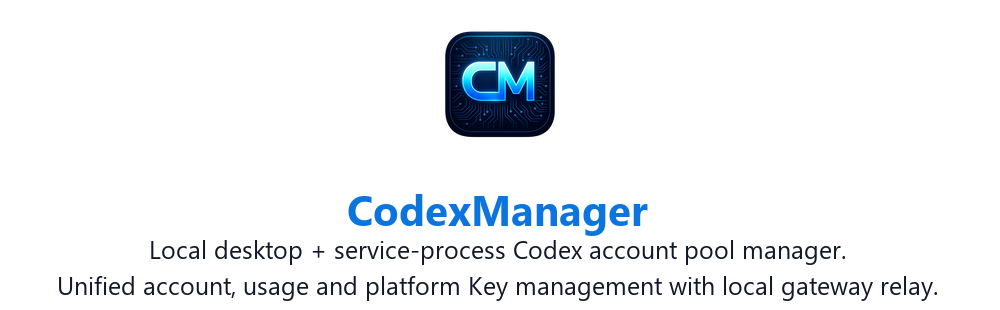
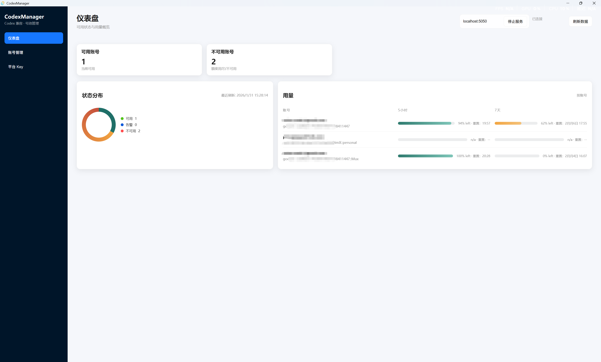
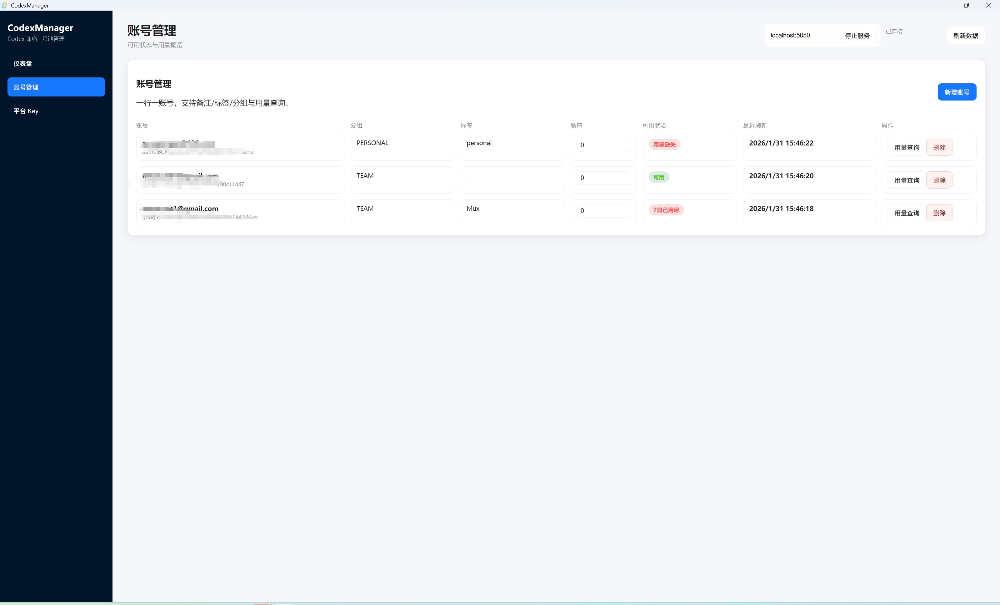
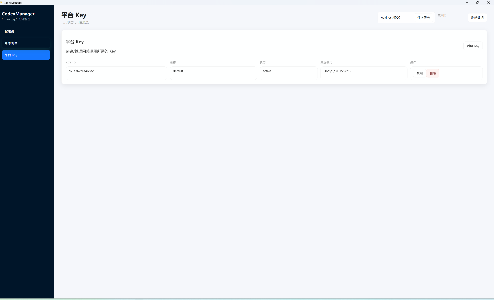

<table align="center">
  <tr>
    <td align="center" valign="middle" width="44%">
      
      <br />
      <sub>
        <a href="https://qxnm.top/">Website</a> ·
        <a href="#sponsors">Sponsors</a>
      </sub>
    </td>
    <td align="center" valign="middle" width="13%">
      <sub>
        <a href="../../README.md">中文</a>
        <br />
        <strong>English</strong>
        <br />
        <a href="../ru/README.md">Русский</a>
        <br />
        <a href="../ko/README.md">한국어</a>
      </sub>
    </td>
    <td align="center" valign="middle" width="23%">
      <a href="https://github.com/qxcnm/Codex-Manager">
        
      </a>
      <br />
      <a href="https://atomgit.com/qxnm/Codex-Manager">
        
      </a>
      <br />
      <a href="https://gitee.com/hongshungao/Codex-Manager">
        
      </a>
    </td>
    <td align="center" valign="middle" width="20%">
      <sub><strong>Community</strong></sub>&nbsp;
      <a href="https://linux.do/t/topic/1688401" title="LINUX DO">
        
      </a>
      &nbsp;
      <a href="https://xuanwu.openatom.org/articles/project/codex-manager/" title="Xuanwu Community">
        
      </a>
    </td>
  </tr>
</table>

**CodexManager has joined the [Xuanwu Community](https://xuanwu.openatom.org/articles/project/codex-manager/)**, a Rust technical community incubated and operated by the OpenAtom Foundation.

<table>
  <tr>
    <td valign="top" width="50%">
      <strong>Source Code Note</strong>
      <br />
      <sub>
        This product was built under my direction with AI: Codex (98%) and Gemini (2%). If you encounter a problem, please communicate respectfully. I do not have enough environments to validate every package and can guarantee only the Windows desktop build. For other platforms, test thoroughly before opening an Issue. Thank you to everyone who reports platform-specific problems and helps with testing.
      </sub>
    </td>
    <td valign="top" width="50%">
      <strong>Disclaimer</strong>
      <br />
      <sub>
        This project is intended solely for learning and development; users must comply with the terms of service of the relevant platforms, including OpenAI and Anthropic; the author does not provide or distribute accounts, API keys, or proxy services and is not responsible for specific uses of this software; do not use this project to circumvent rate limits or service restrictions.
      </sub>
    </td>
  </tr>
</table>

## Documentation Index

`docs/` is the official long-form documentation directory for CodexManager.

Its purpose is simple:
- Keep governance notes, release guides, and operating manuals inside the repository.
- Make it easy for new contributors to find the right document without relying on tribal knowledge.

## Project Snapshot

CodexManager is a local desktop + service-process account pool manager and gateway relay for Codex workflows.

- Unified account, usage, and platform-key management.
- Local OpenAI-compatible gateway for Codex CLI, Gemini CLI, Claude Code, and third-party tools.
- Supports account routing, model/profile overrides, and aggregate API upstream relays.

## Feature Overview

- Account pool management: groups, tags, ordering, notes, ban recognition, and filtering.
- Batch import/export: multi-file import, desktop recursive folder import, per-account export.
- Usage display: 5-hour + 7-day windows, single-window accounts, and official extra buckets such as Code Review / Spark.
- Account authorization: `chatgpt.com` browser OAuth and Device Code login; browser OAuth also supports manual callback parsing.
- Platform keys: create, disable, delete, model binding, reasoning tier, and service tier; administrators can bind a key to a custom account group, intersect it with the plan filter, and rotate only inside that authorized pool.
- Aggregate API: create/edit/test third-party relay upstreams with supplier naming and priority ordering.
- Plugin center: built-in, private, and custom source modes with task/log views and Rhai integration.
- Skills and plugins: `/skills/` separates **Skills Installation** from **Codex Plugin Installation**. Skills can be installed individually from built-in or custom GitHub repositories and skills.sh search results, or imported from ZIPs and existing directories; the native Codex Marketplace remains available for complete plugin installation, and `.system` skills stay read-only.
- Desktop project launcher: bookmark local project folders; on Windows and macOS, open the workspace in the ChatGPT Codex App, while Sessions keeps the local Codex CLI `resume` picker with the local CodexManager profile. Web and Docker never access device folders.
- Local service + gateway: custom bind/listen settings, upstream proxy, total request timeout, stream idle timeout, SSE keepalive, and a unified compatible endpoint. SSE keepalive is enabled by default; set `CODEXMANAGER_SSE_KEEPALIVE_ENABLED=0` (or `false`) to disable it.
- Image generation: automatically injects the official Codex `image_generation` tool for `/v1/responses` by default, forwards explicit tools unchanged, and exposes compatible `/v1/images/generations` and `/v1/images/edits` endpoints with `gpt-image-2` as the default image tool model.

## Quick Start

1. Launch desktop app and click **Start Service**.
2. Open **Account Management** and choose browser authorization or Device Code login for `chatgpt.com`.
3. If a browser callback fails, paste its callback URL for manual parsing.
4. Refresh usage and verify account status.

## Screenshots






## Scope
- Root `README.md` and localized `docs/*/README.md`: project overview and quick start.
- Root `CHANGELOG.md`: version history and unreleased changes.
- `report/*`: operations, troubleshooting, compatibility notes, and FAQs.
- `release/*`: build, packaging, release, and artifact documentation.

## Start here
- For the latest release notes, see [CHANGELOG.md](CHANGELOG.md).
- If you are not sure which document to open first, use the table below.

## Sponsors

Thanks to the following sponsors for supporting CodexManager.

<table>
  <tr>
    <td align="center" valign="middle" width="180">
      <a href="https://www.aixiamo.com/?utm_source=github&utm_medium=sponsor&utm_campaign=codex_manager">
        
      </a>
    </td>
    <td valign="top">
      Thanks to <strong>AI夏末 AIXiamo</strong> for sponsoring this project! Recommended for users in China without an international bank card who need ChatGPT, Claude, Codex, or other AI services. It supports Alipay / WeChat Pay with top-up assistance and reliable after-sales support. Visit the <a href="https://www.aixiamo.com/?utm_source=github&utm_medium=sponsor&utm_campaign=codex_manager">official site</a> to view services.
    </td>
  </tr>
  <tr>
    <td align="center" valign="middle" width="180">
      <a href="https://gzxsy.vip/register?aff=eapz">
        
      </a>
    </td>
    <td valign="top">
      <strong>Xing Si Yan Gateway</strong> provides stable relay and supporting services for Claude Code, Codex, and similar model-call scenarios. It is suitable for developers and teams that require highly available APIs, convenient onboarding, and continuous delivery support. Visit the <a href="https://gzxsy.vip/register?aff=eapz">official site</a> for the latest plans.
    </td>
  </tr>
</table>

Other supporters: [Wonderdch](https://github.com/Wonderdch), [suxinwl](https://github.com/suxinwl), [Hermit](https://github.com/HermitChen), [Suifeng023](https://github.com/Suifeng023), [HK-hub](https://github.com/HK-hub)

## Quick navigation
| What you need | Open this document |
| --- | --- |
| First launch, deployment, Docker, macOS allowlisting | [Runtime and Deployment Guide](report/runtime-and-deployment-guide.md) |
| Configure Codex CLI / ccswitch `auth.json` and `config.toml` | [Runtime and Deployment Guide](report/runtime-and-deployment-guide.md#connect-through-ccswitch) |
| Environment variables, database, ports, proxy, listen address | [Environment and Runtime Configuration](report/environment-and-runtime-config.md) |
| Account routing, import errors, challenge interception | [FAQ and Account Routing Rules](report/faq-and-account-routing-rules.md) |
| Why background jobs skip or disable accounts | [Background Task Account Skip Notes](report/background-task-account-skip-notes.md) |
| Minimum plugin marketplace integration | [Plugin Center Minimal Integration](report/plugin-center-minimal-integration.md) |
| Internal commands and integration surfaces | [System Internal Interface Inventory](report/system-internal-interface-inventory.md) |
| Local build, packaging, and release scripts | [Build, Release, and Script Guide](release/build-release-and-scripts.md) |

## Directory guide

### `release/`
Release notes, rollback notes, artifact descriptions, and packaging guides.

### `report/`
Operational guides, troubleshooting notes, compatibility reports, and FAQs.

## Recommended reading

### Operations
| Document | Summary |
| --- | --- |
| [Runtime and Deployment Guide](report/runtime-and-deployment-guide.md) | Desktop first launch, Service edition, Docker, and macOS first-run handling |
| [Environment and Runtime Configuration](report/environment-and-runtime-config.md) | Runtime configuration, defaults, and environment variables |
| [FAQ and Account Routing Rules](report/faq-and-account-routing-rules.md) | Common account-routing issues and troubleshooting tips |
| [Gateway vs Official Codex Params](report/gateway-vs-codex-official-params.md) | Current outbound parameter differences compared with official Codex |
| [Background Task Account Skip Notes](report/background-task-account-skip-notes.md) | Why background jobs skip, cool down, or disable accounts |
| [Minimal Troubleshooting Guide](report/minimal-troubleshooting-guide.md) | Fast checks for the most common startup and relay issues |
| [Plugin Center Minimal Integration](report/plugin-center-minimal-integration.md) | Minimum fields and interfaces required for plugin marketplace access |
| [Gateway vs Codex Headers and Params](report/gateway-vs-codex-headers-and-params.md) | Header and request parameter differences between the gateway and Codex |
| [Plugin Center Integration and Interfaces](report/plugin-center-integration-and-interfaces.md) | Marketplace modes, RPC/Tauri commands, manifest fields, and Rhai interfaces |
| [System Internal Interface Inventory](report/system-internal-interface-inventory.md) | Internal commands, RPC endpoints, and built-in plugin functions |

### Build and release
| Document | Summary |
| --- | --- |
| [Build, Release, and Script Guide](release/build-release-and-scripts.md) | Local builds, script parameters, and GitHub workflow entry points |
| [Release and Artifacts](release/release-and-artifacts.md) | Release artifacts, naming, and publication rules |
| [Script and Release Responsibility Matrix](report/script-and-release-responsibility-matrix.md) | Which script or workflow is responsible for which task |

## Contribution rules

### Commit documentation when it
- remains useful for future contributors,
- affects development, testing, release, or troubleshooting,
- or serves as a long-term source of truth.

### Do not commit documentation when it is
- a temporary draft,
- personal working notes,
- a disposable intermediate file,
- or a local-only experiment record.

## Ignored patterns
- `docs/**/*.tmp.md`
- `docs/**/*.local.md`

Do not use those suffixes for formal documentation.

## Naming

```text
Long-lived documents: topic.md
One-off reports: yyyyMMddHHmmssfff_topic.md
```

## Maintenance notes
- Add important governance material under `docs/` instead of expanding the README indefinitely.
- Keep version history in `CHANGELOG.md`.
- Keep architecture notes in `ARCHITECTURE.md`.
- Keep collaboration rules in `CONTRIBUTING.md`.
- Put unreleased change details in `CHANGELOG.md`; keep the README focused on navigation and summary.

## Contact
- WeChat: add `ProsperGao` to join the group, and please mention your purpose
- Telegram group: [CodexManager TG group](https://t.me/+OdpFa9GvjxhjMDhl)
